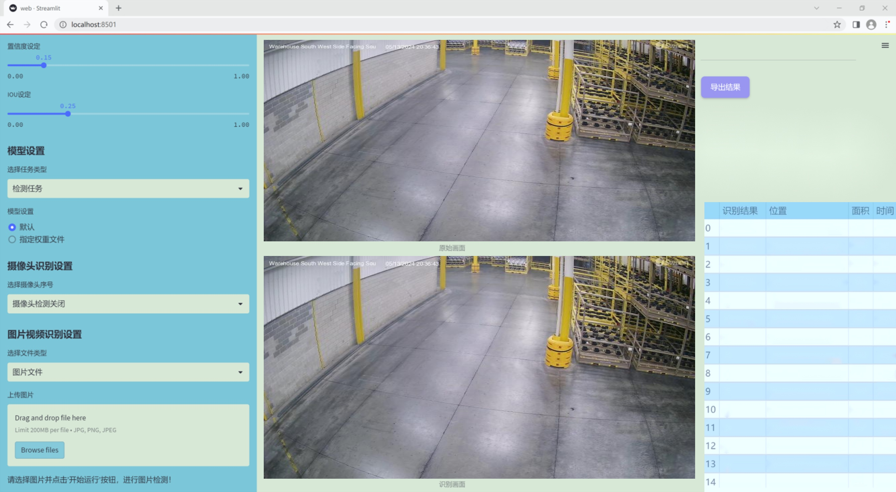
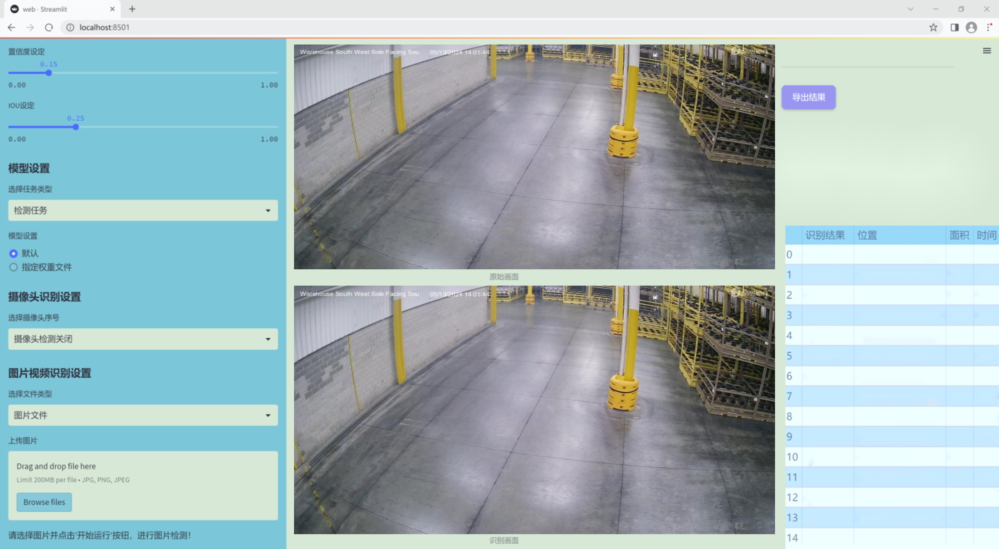
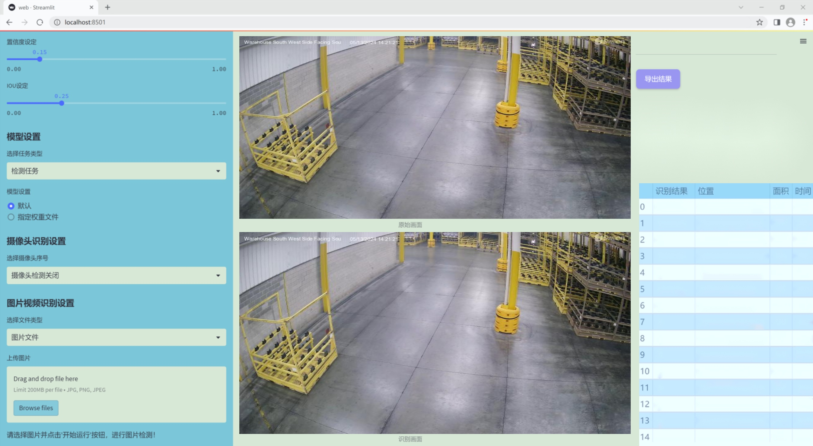
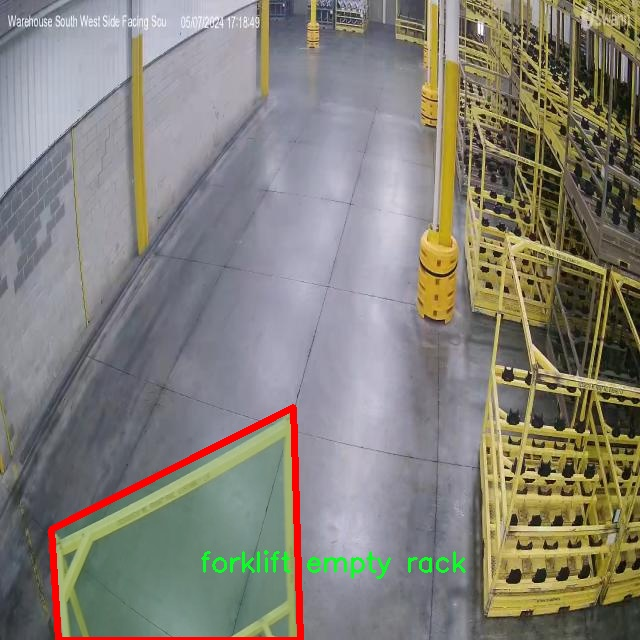
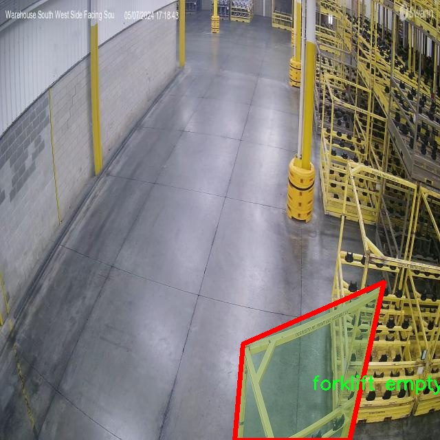
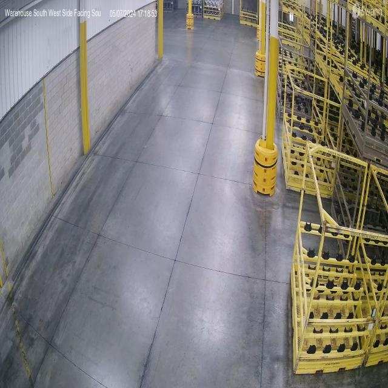
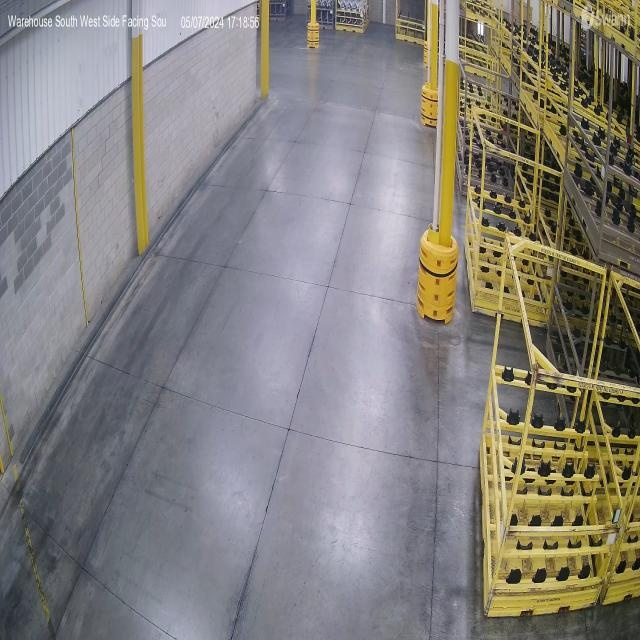
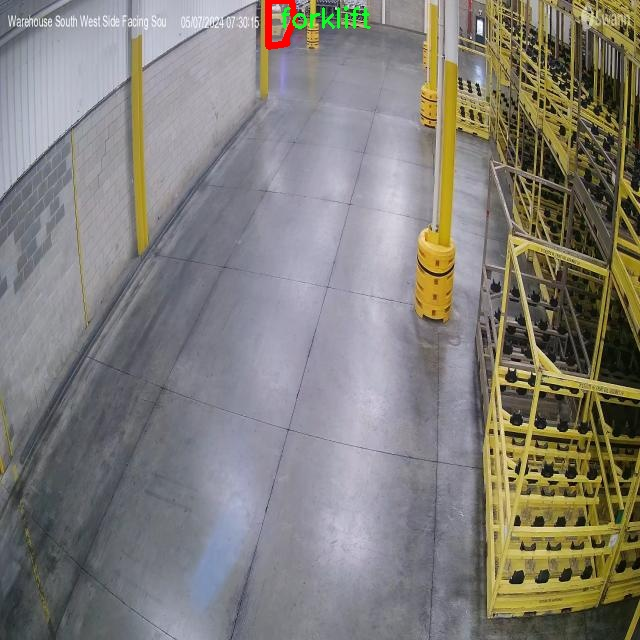

# 改进yolo11-DBB等200+全套创新点大全：叉车满载空载装载状态检测与图像分割系统源码＆数据集全套

### 1.图片效果展示







##### 项目来源 **[人工智能促进会 2024.10.24](https://kdocs.cn/l/cszuIiCKVNis)**

注意：由于项目一直在更新迭代，上面“1.图片效果展示”和“2.视频效果展示”展示的系统图片或者视频可能为老版本，新版本在老版本的基础上升级如下：（实际效果以升级的新版本为准）

  （1）适配了YOLOV11的“目标检测”模型和“实例分割”模型，通过加载相应的权重（.pt）文件即可自适应加载模型。

  （2）支持“图片识别”、“视频识别”、“摄像头实时识别”三种识别模式。

  （3）支持“图片识别”、“视频识别”、“摄像头实时识别”三种识别结果保存导出，解决手动导出（容易卡顿出现爆内存）存在的问题，识别完自动保存结果并导出到tempDir中。

  （4）支持Web前端系统中的标题、背景图等自定义修改。

  另外本项目提供训练的数据集和训练教程,暂不提供权重文件（best.pt）,需要您按照教程进行训练后实现图片演示和Web前端界面演示的效果。

### 2.视频效果展示

[2.1 视频效果展示](https://www.bilibili.com/video/BV1H91NY3ES2/)

### 3.背景

研究背景与意义

随着工业自动化的快速发展，叉车作为重要的物料搬运设备，其在仓储和物流管理中的应用愈发广泛。叉车的装载状态直接影响到仓库的运营效率和安全性，因此，实时监测叉车的满载与空载状态显得尤为重要。传统的人工监测方法不仅效率低下，而且容易出现人为错误，无法满足现代物流行业对高效、精准管理的需求。因此，基于计算机视觉的自动化检测系统应运而生，成为提升叉车作业效率和安全性的有效手段。

本研究旨在基于改进的YOLOv11模型，构建一个高效的叉车满载与空载装载状态检测与图像分割系统。YOLO（You Only Look Once）系列模型以其快速的检测速度和较高的准确率，广泛应用于物体检测领域。通过对YOLOv11进行改进，我们可以进一步提升其在复杂环境下的检测性能，尤其是在叉车的不同装载状态下的识别能力。

在数据集方面，本研究使用了包含1400张图像的Camera-7模块数据集，涵盖了多种叉车状态，包括“叉车空架”、“叉车满架”、“叉车小架”等类别。这些数据的多样性为模型的训练提供了丰富的样本，有助于提高模型的泛化能力。此外，数据集中还包含了“人”和“冰车”等其他类别，有助于在实际应用中实现对叉车周边环境的全面监测。

通过构建这一系统，不仅可以实现对叉车装载状态的自动化检测，还能够为仓储管理提供实时数据支持，进而优化仓库作业流程，提高整体运营效率。这一研究的成功实施，将为智能仓储与物流管理领域的发展提供重要的技术支持，具有显著的实际应用价值和社会意义。

### 4.数据集信息展示

##### 4.1 本项目数据集详细数据（类别数＆类别名）

nc: 6
names: ['forklift', 'forklift empty rack', 'forklift full rack', 'forklift small rack', 'person', 'zamboni']


该项目为【图像分割】数据集，请在【训练教程和Web端加载模型教程（第三步）】这一步的时候按照【图像分割】部分的教程来训练

##### 4.2 本项目数据集信息介绍

本项目数据集信息介绍

本项目旨在改进YOLOv11模型，以实现对叉车在满载和空载状态下的装载状态检测与图像分割。为此，我们构建并使用了名为“Camera-7”的数据集，该数据集专门设计用于训练和评估模型在实际应用场景中的表现。数据集包含六个类别，具体包括“叉车”、“空载叉车架”、“满载叉车架”、“小叉车架”、“人员”和“清扫车”。这些类别的选择不仅涵盖了叉车的不同状态和类型，还考虑到了与叉车操作相关的环境因素，如人员的存在和清扫车的干扰，这对于提升模型的准确性和鲁棒性至关重要。

“Camera-7”数据集由多种场景下的图像组成，涵盖了叉车在不同工作环境中的表现，包括仓库、物流中心和室外作业场地。每个类别的图像均经过精心标注，确保模型能够学习到每种状态的特征和细微差别。通过对这些图像的深度学习，模型将能够有效识别叉车的工作状态，从而在实际应用中实现更高效的作业调度和安全管理。

此外，数据集还考虑了多样性和复杂性，包含了不同光照条件、天气变化以及叉车与其他物体（如人员和清扫车）相互作用的场景。这种多样性不仅增强了模型的泛化能力，还使其在面对现实世界中的复杂情况时，能够做出更为准确的判断。通过对“Camera-7”数据集的深入挖掘和分析，我们期望能够显著提升YOLOv11在叉车状态检测与图像分割任务中的性能，为叉车的智能化管理提供有力支持。











### 5.全套项目环境部署视频教程（零基础手把手教学）

[5.1 所需软件PyCharm和Anaconda安装教程（第一步）](https://www.bilibili.com/video/BV1BoC1YCEKi/?spm_id_from=333.999.0.0&vd_source=bc9aec86d164b67a7004b996143742dc)


[5.2 安装Python虚拟环境创建和依赖库安装视频教程（第二步）](https://www.bilibili.com/video/BV1ZoC1YCEBw?spm_id_from=333.788.videopod.sections&vd_source=bc9aec86d164b67a7004b996143742dc)

### 6.改进YOLOv11训练教程和Web_UI前端加载模型教程（零基础手把手教学）

[6.1 改进YOLOv11训练教程和Web_UI前端加载模型教程（第三步）](https://www.bilibili.com/video/BV1BoC1YCEhR?spm_id_from=333.788.videopod.sections&vd_source=bc9aec86d164b67a7004b996143742dc)


按照上面的训练视频教程链接加载项目提供的数据集，运行train.py即可开始训练



     Epoch   gpu_mem       box       obj       cls    labels  img_size
     1/200     20.8G   0.01576   0.01955  0.007536        22      1280: 100%|██████████| 849/849 [14:42<00:00,  1.04s/it]
               Class     Images     Labels          P          R     mAP@.5 mAP@.5:.95: 100%|██████████| 213/213 [01:14<00:00,  2.87it/s]
                 all       3395      17314      0.994      0.957      0.0957      0.0843

     Epoch   gpu_mem       box       obj       cls    labels  img_size
     2/200     20.8G   0.01578   0.01923  0.007006        22      1280: 100%|██████████| 849/849 [14:44<00:00,  1.04s/it]
               Class     Images     Labels          P          R     mAP@.5 mAP@.5:.95: 100%|██████████| 213/213 [01:12<00:00,  2.95it/s]
                 all       3395      17314      0.996      0.956      0.0957      0.0845

     Epoch   gpu_mem       box       obj       cls    labels  img_size
     3/200     20.8G   0.01561    0.0191  0.006895        27      1280: 100%|██████████| 849/849 [10:56<00:00,  1.29it/s]
               Class     Images     Labels          P          R     mAP@.5 mAP@.5:.95: 100%|███████   | 187/213 [00:52<00:00,  4.04it/s]
                 all       3395      17314      0.996      0.957      0.0957      0.0845


###### [项目数据集下载链接](https://kdocs.cn/l/cszuIiCKVNis)

### 7.原始YOLOv11算法讲解

YOLOv11是Ultralytics推出的YOLO系列最新版本，专为实现尖端的物体检测而设计。其架构和训练方法上进行了重大改进，使之不仅具备卓越的准确性和处理速度，还在计算效率上实现了一场革命。得益于其改进的主干和颈部架构，YOLOv11在特征提取和处理复杂任务时表现更加出色。在2024年9月27日，Ultralytics通过长达九小时的在线直播发布这一新作，展示了其在计算机视觉领域的革新。

YOLOv11通过精细的架构设计和优化训练流程，在保持高精度的同时，缩减了参数量，与YOLOv8m相比减少了22%的参数，使其在COCO数据集上的平均准确度（mAP）有所提升。这种效率的提高使YOLOv11非常适合部署在各种硬件环境中，包括边缘设备、云计算平台以及支持NVIDIA GPU的系统，确保在灵活性上的优势。

该模型支持广泛的任务，从对象检测、实例分割到图像分类、姿态估计和定向对象检测（OBB），几乎覆盖了计算机视觉的所有主要挑战。其创新的C3k2和C2PSA模块提升了网络深度和注意力机制的应用，提高了特征提取的效率和效果。同时，YOLOv11的改进网络结构也使之在复杂视觉任务上得以从容应对，成为各类计算机视觉任务的多功能选择。这些特性令YOLOv11在实施实时物体检测的各个领域中表现出众。
* * *

2024年9月27日，Ultralytics在线直播长达九小时，为YOLO11召开“发布会”

YOLO11 是 Ultralytics YOLO 系列实时物体检测器的最新版本，它以尖端的准确性、速度和效率重新定义了可能性。在之前 YOLO
版本的显著进步的基础上，YOLO11 在架构和训练方法方面进行了重大改进，使其成为各种计算机视觉任务的多功能选择。


##### YOLO11主要特点：

  * 增强的特征提取：YOLO11 采用了改进的主干和颈部架构，增强了特征提取能力，可实现更精确的对象检测和复杂任务性能。
  * 针对效率和速度进行了优化：YOLO11 引入了完善的架构设计和优化的训练流程，可提供更快的处理速度，并在准确度和性能之间保持最佳平衡。
  * 更少的参数，更高的准确度：借助模型设计的进步，YOLO11m 在 COCO 数据集上实现了更高的平均准确度 (mAP)，同时使用的参数比 YOLOv8m 少 22%，从而提高了计算效率，同时又不影响准确度。
  * 跨环境的适应性：YOLO11 可以无缝部署在各种环境中，包括边缘设备、云平台和支持 NVIDIA GPU 的系统，从而确保最大的灵活性。
  * 支持的任务范围广泛：无论是对象检测、实例分割、图像分类、姿势估计还是定向对象检测 (OBB)，YOLO11 都旨在满足各种计算机视觉挑战。

##### 支持的任务和模式

YOLO11 以 YOLOv8 中引入的多功能模型系列为基础，为各种计算机视觉任务提供增强的支持：

Model| Filenames| Task| Inference| Validation| Training| Export  
---|---|---|---|---|---|---  
YOLO11| yolol11n.pt, yolol11s.pt, yolol11m.pt, yolol11x.pt| Detection| ✅| ✅|
✅| ✅  
YOLO11-seg| yolol11n-seg.pt, yolol11s-seg.pt, yolol11m-seg.pt,
yolol11x-seg.pt| Instance Segmentation| ✅| ✅| ✅| ✅  
YOLO11-pose| yolol11n-pose.pt, yolol11s-pose.pt, yolol11m-pose.pt,
yolol11x-pose.pt| Pose/Keypoints| ✅| ✅| ✅| ✅  
YOLO11-obb| yolol11n-obb.pt, yolol11s-obb.pt, yolol11m-obb.pt,
yolol11x-obb.pt| Oriented Detection| ✅| ✅| ✅| ✅  
YOLO11-cls| yolol11n-cls.pt, yolol11s-cls.pt, yolol11m-cls.pt,
yolol11x-cls.pt| Classification| ✅| ✅| ✅| ✅  
  
##### 简单的 YOLO11 训练和推理示例

以下示例适用于用于对象检测的 YOLO11 Detect 模型。

    
    
    from ultralytics import YOLO
    
    # Load a model
    model = YOLO("yolo11n.pt")
    
    # Train the model
    train_results = model.train(
        data="coco8.yaml",  # path to dataset YAML
        epochs=100,  # number of training epochs
        imgsz=640,  # training image size
        device="cpu",  # device to run on, i.e. device=0 or device=0,1,2,3 or device=cpu
    )
    
    # Evaluate model performance on the validation set
    metrics = model.val()
    
    # Perform object detection on an image
    results = model("path/to/image.jpg")
    results[0].show()
    
    # Export the model to ONNX format
    path = model.export(format="onnx")  # return path to exported model

##### 支持部署于边缘设备

YOLO11 专为适应各种环境而设计，包括边缘设备。其优化的架构和高效的处理能力使其适合部署在边缘设备、云平台和支持 NVIDIA GPU
的系统上。这种灵活性确保 YOLO11 可用于各种应用，从移动设备上的实时检测到云环境中的复杂分割任务。有关部署选项的更多详细信息，请参阅导出文档。

##### YOLOv11 yaml文件

    
    
    # Ultralytics YOLO 🚀, AGPL-3.0 license
    # YOLO11 object detection model with P3-P5 outputs. For Usage examples see https://docs.ultralytics.com/tasks/detect
    
    # Parameters
    nc: 80 # number of classes
    scales: # model compound scaling constants, i.e. 'model=yolo11n.yaml' will call yolo11.yaml with scale 'n'
      # [depth, width, max_channels]
      n: [0.50, 0.25, 1024] # summary: 319 layers, 2624080 parameters, 2624064 gradients, 6.6 GFLOPs
      s: [0.50, 0.50, 1024] # summary: 319 layers, 9458752 parameters, 9458736 gradients, 21.7 GFLOPs
      m: [0.50, 1.00, 512] # summary: 409 layers, 20114688 parameters, 20114672 gradients, 68.5 GFLOPs
      l: [1.00, 1.00, 512] # summary: 631 layers, 25372160 parameters, 25372144 gradients, 87.6 GFLOPs
      x: [1.00, 1.50, 512] # summary: 631 layers, 56966176 parameters, 56966160 gradients, 196.0 GFLOPs
    
    # YOLO11n backbone
    backbone:
      # [from, repeats, module, args]
      - [-1, 1, Conv, [64, 3, 2]] # 0-P1/2
      - [-1, 1, Conv, [128, 3, 2]] # 1-P2/4
      - [-1, 2, C3k2, [256, False, 0.25]]
      - [-1, 1, Conv, [256, 3, 2]] # 3-P3/8
      - [-1, 2, C3k2, [512, False, 0.25]]
      - [-1, 1, Conv, [512, 3, 2]] # 5-P4/16
      - [-1, 2, C3k2, [512, True]]
      - [-1, 1, Conv, [1024, 3, 2]] # 7-P5/32
      - [-1, 2, C3k2, [1024, True]]
      - [-1, 1, SPPF, [1024, 5]] # 9
      - [-1, 2, C2PSA, [1024]] # 10
    
    # YOLO11n head
    head:
      - [-1, 1, nn.Upsample, [None, 2, "nearest"]]
      - [[-1, 6], 1, Concat, [1]] # cat backbone P4
      - [-1, 2, C3k2, [512, False]] # 13
    
      - [-1, 1, nn.Upsample, [None, 2, "nearest"]]
      - [[-1, 4], 1, Concat, [1]] # cat backbone P3
      - [-1, 2, C3k2, [256, False]] # 16 (P3/8-small)
    
      - [-1, 1, Conv, [256, 3, 2]]
      - [[-1, 13], 1, Concat, [1]] # cat head P4
      - [-1, 2, C3k2, [512, False]] # 19 (P4/16-medium)
    
      - [-1, 1, Conv, [512, 3, 2]]
      - [[-1, 10], 1, Concat, [1]] # cat head P5
      - [-1, 2, C3k2, [1024, True]] # 22 (P5/32-large)
    
      - [[16, 19, 22], 1, Detect, [nc]] # Detect(P3, P4, P5)
    

**YOLO11和YOLOv8 yaml文件的区别**


##### 改进模块代码

  * C3k2 

    
    
    class C3k2(C2f):
        """Faster Implementation of CSP Bottleneck with 2 convolutions."""
    
        def __init__(self, c1, c2, n=1, c3k=False, e=0.5, g=1, shortcut=True):
            """Initializes the C3k2 module, a faster CSP Bottleneck with 2 convolutions and optional C3k blocks."""
            super().__init__(c1, c2, n, shortcut, g, e)
            self.m = nn.ModuleList(
                C3k(self.c, self.c, 2, shortcut, g) if c3k else Bottleneck(self.c, self.c, shortcut, g) for _ in range(n)
            )

C3k2，它是具有两个卷积的CSP（Partial Cross Stage）瓶颈架构的更快实现。

**类继承：**

  * `C3k2`继承自类`C2f`。这表明`C2f`很可能实现了经过修改的基本CSP结构，而`C3k2`进一步优化或修改了此结构。

**构造函数（`__init__`）：**

  * `c1`：输入通道。

  * `c2`：输出通道。

  * `n`：瓶颈层数（默认为1）。

  * `c3k`：一个布尔标志，确定是否使用`C3k`块或常规`Bottleneck`块。

  * `e`：扩展比率，控制隐藏层的宽度（默认为0.5）。

  * `g`：分组卷积的组归一化参数或组数（默认值为 1）。

  * `shortcut`：一个布尔值，用于确定是否在网络中包含快捷方式连接（默认值为 `True`）。

**初始化：**

  * `super().__init__(c1, c2, n, short-cut, g, e)` 调用父类 `C2f` 的构造函数，初始化标准 CSP 组件，如通道数、快捷方式、组等。

**模块列表（`self.m`）：**

  * `nn.ModuleList` 存储 `C3k` 或 `Bottleneck` 模块，具体取决于 `c3k` 的值。

  * 如果 `c3k` 为 `True`，它会初始化 `C3k` 模块。`C3k` 模块接收以下参数：

  * `self.c`：通道数（源自 `C2f`）。

  * `2`：这表示在 `C3k` 块内使用了两个卷积层。

  * `shortcut` 和 `g`：从 `C3k2` 构造函数传递。

  * 如果 `c3k` 为 `False`，则初始化标准 `Bottleneck` 模块。

`for _ in range(n)` 表示将创建 `n` 个这样的块。

**总结：**

  * `C3k2` 实现了 CSP 瓶颈架构，可以选择使用自定义 `C3k` 块（具有两个卷积）或标准 `Bottleneck` 块，具体取决于 `c3k` 标志。

  * C2PSA

    
    
    class C2PSA(nn.Module):
        """
        C2PSA module with attention mechanism for enhanced feature extraction and processing.
    
        This module implements a convolutional block with attention mechanisms to enhance feature extraction and processing
        capabilities. It includes a series of PSABlock modules for self-attention and feed-forward operations.
    
        Attributes:
            c (int): Number of hidden channels.
            cv1 (Conv): 1x1 convolution layer to reduce the number of input channels to 2*c.
            cv2 (Conv): 1x1 convolution layer to reduce the number of output channels to c.
            m (nn.Sequential): Sequential container of PSABlock modules for attention and feed-forward operations.
    
        Methods:
            forward: Performs a forward pass through the C2PSA module, applying attention and feed-forward operations.
    
        Notes:
            This module essentially is the same as PSA module, but refactored to allow stacking more PSABlock modules.
    
        Examples:
            >>> c2psa = C2PSA(c1=256, c2=256, n=3, e=0.5)
            >>> input_tensor = torch.randn(1, 256, 64, 64)
            >>> output_tensor = c2psa(input_tensor)
        """
    
        def __init__(self, c1, c2, n=1, e=0.5):
            """Initializes the C2PSA module with specified input/output channels, number of layers, and expansion ratio."""
            super().__init__()
            assert c1 == c2
            self.c = int(c1 * e)
            self.cv1 = Conv(c1, 2 * self.c, 1, 1)
            self.cv2 = Conv(2 * self.c, c1, 1)
    
            self.m = nn.Sequential(*(PSABlock(self.c, attn_ratio=0.5, num_heads=self.c // 64) for _ in range(n)))
    
        def forward(self, x):
            """Processes the input tensor 'x' through a series of PSA blocks and returns the transformed tensor."""
            a, b = self.cv1(x).split((self.c, self.c), dim=1)
            b = self.m(b)
            return self.cv2(torch.cat((a, b), 1))

`C2PSA` 模块是一个自定义神经网络层，带有注意力机制，用于增强特征提取和处理。

**类概述**

  * **目的：**

  * `C2PSA` 模块引入了一个卷积块，利用注意力机制来改进特征提取和处理。

  * 它使用一系列 `PSABlock` 模块，这些模块可能代表某种形式的位置自注意力 (PSA)，并且该架构旨在允许堆叠多个 `PSABlock` 层。

**构造函数（`__init__`）：**

  * **参数：**

  * `c1`：输入通道（必须等于 `c2`）。

  * `c2`：输出通道（必须等于 `c1`）。

  * `n`：要堆叠的 `PSABlock` 模块数量（默认值为 1）。

  * `e`：扩展比率，用于计算隐藏通道的数量（默认值为 0.5）。

  * **属性：**

  * `self.c`：隐藏通道数，计算为 `int(c1 * e)`。

  * `self.cv1`：一个 `1x1` 卷积，将输入通道数从 `c1` 减少到 `2 * self.c`。这为将输入分成两部分做好准备。

  * `self.cv2`：另一个 `1x1` 卷积，处理后将通道维度恢复回 `c1`。

  * `self.m`：一系列 `PSABlock` 模块。每个 `PSABlock` 接收 `self.c` 通道，注意头的数量为 `self.c // 64`。每个块应用注意和前馈操作。

**前向方法：**

  * **输入：**

  * `x`，输入张量。

  * **操作：**

  1. `self.cv1(x)` 应用 `1x1` 卷积，将输入通道大小从 `c1` 减小到 `2 * self.c`。

  2. 生成的张量沿通道维度分为两部分，`a` 和 `b`。

  * `a`：第一个 `self.c` 通道。

  * `b`：剩余的 `self.c` 通道。

  1. `b` 通过顺序容器 `self.m`，它是 `PSABlock` 模块的堆栈。这部分经过基于注意的处理。

  2. 处理后的张量 `b` 与 `a` 连接。

  3. `self.cv2` 应用 `1x1` 卷积，将通道大小恢复为 `c1`。

  * **输出：**

  * 应用注意和卷积操作后的变换后的张量。

**总结：**

  * **C2PSA** 是一个增强型卷积模块，它通过堆叠的 `PSABlock` 模块应用位置自注意力。它拆分输入张量，将注意力应用于其中一部分，然后重新组合并通过最终卷积对其进行处理。此结构有助于从输入数据中提取复杂特征。

##### 网络结构


### 8.200+种全套改进YOLOV11创新点原理讲解

#### 8.1 200+种全套改进YOLOV11创新点原理讲解大全

由于篇幅限制，每个创新点的具体原理讲解就不全部展开，具体见下列网址中的改进模块对应项目的技术原理博客网址【Blog】（创新点均为模块化搭建，原理适配YOLOv5~YOLOv11等各种版本）

[改进模块技术原理博客【Blog】网址链接](https://gitee.com/qunmasj/good)


#### 8.2 精选部分改进YOLOV11创新点原理讲解

###### 这里节选部分改进创新点展开原理讲解(完整的改进原理见上图和[改进模块技术原理博客链接](https://gitee.com/qunmasj/good)【如果此小节的图加载失败可以通过CSDN或者Github搜索该博客的标题访问原始博客，原始博客图片显示正常】


### Context_Grided_Network(CGNet)简介
参考该博客提出的一种轻量化语义分割模型Context Grided Network(CGNet)，以满足设备的运行需要。

CGNet主要由CG块构建而成，CG块可以学习局部特征和周围环境上下文的联合特征，最后通过引入全局上下文特征进一步改善联合特征的学习。


 
下图给出了在Cityscapes数据集上对现有的一些语义分割模型的测试效果，横轴表示参数量，纵轴表示准确率(mIoU)。可以看出，在参数量较少的情况下，CGNet可以达到一个比较好的准确率。虽与高精度模型相去甚远，但在一些对精度要求不高、对实时性要求比较苛刻的情况下，很有价值。


高精度模型，如DeepLab、DFN、DenseASPP等，动不动就是几十M的参数，很难应用在移动设备上。而上图中红色的模型，相对内存占用较小，但它们的分割精度却不是很高。作者认为主要原因是，这些小网络大多遵循着分类网络的设计思路，并没有考虑语义分割任务更深层次的特点。

空间依赖性和上下文信息对提高分割精度有很大的作用。作者从该角度出发，提出了CG block，并进一步搭建了轻量级语义分割网络CGNet。CG块具有以下特点： 

学习局部特征和上下文特征的联合特征；
通过全局上下文特征改进上述联合特征；
可以贯穿应用在整个网络中，从low level（空间级别）到high level（语义级别）。不像PSPNet、DFN、DenseASPP等，只在编码阶段以后捕捉上下文特征。；
只有3个下采样，相比一般5个下采样的网络，能够更好地保留边缘信息。
CGNet遵循“深而薄”的原则设计，整个网络又51层构成。其中，为了降低计算，大量使用了channel-wise conv.

小型语义分割模型：

需要平衡准确率和系统开销
进化路线：ENet -> ICNet -> ESPNet
这些模型基本都基于分类网络设计，在分割准确率上效果并不是很好
上下文信息模型：

大多数现有模型只考虑解码阶段的上下文信息并且没有利用周围的上下文信息
注意力机制：

CG block使用全局上下文信息计算权重向量，并使用其细化局部特征和周围上下文特征的联合特征

#### Context Guided Block
CG block由4部分组成：


此外，CG block还采用了残差学习。文中提出了局部残差学习（LRL）和全局残差学习（GRL）两种方式。 LRL添加了从输入到联合特征提取器的连接，GRL添加了从输入到全局特征提取器的连接。从直观上来说，GRL比LRL更能促进网络中的信息传递（更像ResNet~~），后面实验部分也进行了测试，的确GRL更能提升分割精度。


CGNet的通用网络结构如下图所示，分为3个stage，第一个stage使用3个卷积层抽取特征，第二和第三个stage堆叠一定数量的CG block，具体个数可以根据情况调整。最后，通过1x1 conv得到分割结果。


下图是用于Cityscapes数据集的CGNet网络细节说明：输入尺寸为3*680*680；stage1连续使用了3个Conv-BN-PReLU组合，首个组合使用了stride=2的卷积，所以得到了1/2分辨率的feature map；stage2和stage3分别使用了多个CG block，且其中使用了不同大小的膨胀卷积核，最终分别得到了1/4和1/8的feature map。

需注意：

stage2&3的输入特征分别由其上一个stage的首个和最后一个block组合给出（参考上图的绿色箭头）；

输入注入机制，图中未体现，实际使用中，作者还将输入图像下采样1/4或1/8，分别给到stage2和stage3的输入中 ，以进一步加强特征传递。

channel-wise conv。为了缩减参数数量，在局部特征提取器和周围上下文特征提取器中使用了channel-wise卷积，可以消除跨通道的计算成本，同时节省内存占用。但是，没有像MobileNet等模型一样，在depth-wise卷积后面接point-wise卷积（1*1 conv），作者解释是，因为CG block需要保持局部特征和周围上下文特征的独立性，而1*1 conv会破坏这种独立性，所以效果欠佳，实验部分也进行了验证。

个人感觉此处应该指的是depth-wise卷积？

官方Git中对该部分的实现如下：


### 9.系统功能展示

图9.1.系统支持检测结果表格显示

  图9.2.系统支持置信度和IOU阈值手动调节

  图9.3.系统支持自定义加载权重文件best.pt(需要你通过步骤5中训练获得)

  图9.4.系统支持摄像头实时识别

  图9.5.系统支持图片识别

  图9.6.系统支持视频识别

  图9.7.系统支持识别结果文件自动保存

  图9.8.系统支持Excel导出检测结果数据


### 10. YOLOv11核心改进源码讲解

#### 10.1 pkinet.py

以下是对给定代码的核心部分进行分析和详细注释的结果。保留了最重要的类和函数，删除了不必要的部分。

```python
import math
import torch
import torch.nn as nn

# 定义 DropPath 函数，用于实现随机深度（Stochastic Depth）
def drop_path(x: torch.Tensor, drop_prob: float = 0., training: bool = False) -> torch.Tensor:
    """根据给定的丢弃概率随机丢弃路径（用于残差块的主路径）"""
    if drop_prob == 0. or not training:
        return x  # 如果丢弃概率为0或不在训练模式下，直接返回输入
    keep_prob = 1 - drop_prob
    shape = (x.shape[0], ) + (1, ) * (x.ndim - 1)  # 处理不同维度的张量
    random_tensor = keep_prob + torch.rand(shape, dtype=x.dtype, device=x.device)
    output = x.div(keep_prob) * random_tensor.floor()  # 进行随机丢弃
    return output

# 定义 DropPath 类
class DropPath(nn.Module):
    """随机深度模块"""
    def __init__(self, drop_prob: float = 0.1):
        super().__init__()
        self.drop_prob = drop_prob  # 设置丢弃概率

    def forward(self, x: torch.Tensor) -> torch.Tensor:
        return drop_path(x, self.drop_prob, self.training)  # 前向传播

# 定义卷积模块
class ConvModule(nn.Module):
    """简化的卷积模块，包含卷积、归一化和激活函数"""
    def __init__(self, in_channels, out_channels, kernel_size, stride=1, padding=0, norm_cfg=None, act_cfg=None):
        super().__init__()
        self.conv = nn.Conv2d(in_channels, out_channels, kernel_size, stride, padding)
        self.norm = nn.BatchNorm2d(out_channels) if norm_cfg else None
        self.act = nn.SiLU() if act_cfg else None  # 使用 SiLU 激活函数

    def forward(self, x):
        x = self.conv(x)  # 卷积操作
        if self.norm:
            x = self.norm(x)  # 归一化
        if self.act:
            x = self.act(x)  # 激活
        return x

# 定义 InceptionBottleneck 类
class InceptionBottleneck(nn.Module):
    """Inception 模块的瓶颈结构"""
    def __init__(self, in_channels: int, out_channels: int):
        super().__init__()
        self.pre_conv = ConvModule(in_channels, out_channels, kernel_size=1)  # 预卷积
        self.dw_conv = ConvModule(out_channels, out_channels, kernel_size=3, stride=1, padding=1)  # 深度卷积
        self.pw_conv = ConvModule(out_channels, out_channels, kernel_size=1)  # 点卷积

    def forward(self, x):
        x = self.pre_conv(x)  # 预卷积
        x = self.dw_conv(x)   # 深度卷积
        x = self.pw_conv(x)   # 点卷积
        return x

# 定义 PKIBlock 类
class PKIBlock(nn.Module):
    """多核 Inception 块"""
    def __init__(self, in_channels: int, out_channels: int):
        super().__init__()
        self.block = InceptionBottleneck(in_channels, out_channels)  # 使用 InceptionBottleneck
        self.drop_path = DropPath(0.1)  # 添加 DropPath

    def forward(self, x):
        x = self.block(x)  # 通过 Inception 块
        x = self.drop_path(x)  # 应用 DropPath
        return x

# 定义 PKINet 类
class PKINet(nn.Module):
    """多核 Inception 网络"""
    def __init__(self):
        super().__init__()
        self.stem = ConvModule(3, 32, kernel_size=3, stride=2, padding=1)  # Stem 层
        self.block1 = PKIBlock(32, 64)  # 第一个 PKIBlock
        self.block2 = PKIBlock(64, 128)  # 第二个 PKIBlock

    def forward(self, x):
        x = self.stem(x)  # 通过 Stem 层
        x = self.block1(x)  # 通过第一个 PKIBlock
        x = self.block2(x)  # 通过第二个 PKIBlock
        return x

# 创建模型实例并进行前向传播
if __name__ == '__main__':
    model = PKINet()  # 实例化 PKINet
    inputs = torch.randn((1, 3, 640, 640))  # 随机输入
    res = model(inputs)  # 前向传播
    print(res.size())  # 输出结果的尺寸
```

### 代码核心部分说明：
1. **DropPath**: 实现了随机深度的功能，用于在训练过程中随机丢弃某些路径，以减少过拟合。
2. **ConvModule**: 封装了卷积、归一化和激活函数的组合，简化了网络结构的构建。
3. **InceptionBottleneck**: 实现了 Inception 模块的瓶颈结构，使用了预卷积、深度卷积和点卷积。
4. **PKIBlock**: 组合了 InceptionBottleneck 和 DropPath，形成一个完整的块。
5. **PKINet**: 构建了整个网络结构，包括 Stem 层和多个 PKIBlock。

这些核心部分构成了多核 Inception 网络的基础，能够有效地处理图像输入并进行特征提取。

这个文件 `pkinet.py` 实现了一个名为 PKINet 的深度学习模型，主要用于计算机视觉任务。该模型的设计灵感来自于多核卷积（Poly Kernel Convolution）和注意力机制，具有多个模块和层，旨在提高特征提取的能力。

首先，文件中导入了一些必要的库，包括数学库、PyTorch 及其神经网络模块。接着，尝试从其他库中导入一些组件，如 `ConvModule` 和 `BaseModule`，这些组件在后续的模型构建中将被广泛使用。

接下来，定义了一些实用函数和类。`drop_path` 函数实现了随机深度（Stochastic Depth）技术，允许在训练过程中随机丢弃某些路径，以提高模型的泛化能力。`DropPath` 类则是对这一功能的封装，继承自 `nn.Module`。

`autopad` 函数用于自动计算卷积操作的填充，以确保输出的空间维度符合预期。`make_divisible` 函数则确保通道数是可被指定值整除的，以满足特定的网络结构要求。

文件中还定义了一些张量维度转换的类，如 `BCHW2BHWC` 和 `BHWC2BCHW`，用于在不同的通道格式之间转换。`GSiLU` 类实现了一种全局 Sigmoid 门控线性单元，增强了模型的非线性表达能力。

`CAA` 类实现了上下文锚注意力机制，旨在通过对输入特征进行池化和卷积操作来提取上下文信息。`ConvFFN` 类则实现了一个多层感知机，使用卷积模块来替代传统的全连接层。

`Stem` 类是模型的起始层，负责将输入特征进行初步处理。`DownSamplingLayer` 类用于下采样操作，减小特征图的空间维度。

`InceptionBottleneck` 类实现了一个瓶颈结构，结合了多个不同大小的卷积核，以捕捉多尺度特征。`PKIBlock` 类则是多核卷积块的实现，包含了注意力机制和前馈网络。

`PKIStage` 类将多个 `PKIBlock` 组合在一起，形成模型的一个阶段。`PKINet` 类则是整个网络的主结构，包含多个阶段，并定义了模型的前向传播过程。

在 `PKINet` 的构造函数中，定义了不同的网络架构设置，并根据指定的架构构建模型的各个阶段。`init_weights` 方法用于初始化模型的权重，确保模型在训练开始时具有良好的性能。

最后，文件提供了三个函数 `PKINET_T`、`PKINET_S` 和 `PKINET_B`，用于创建不同版本的 PKINet 模型。主程序部分则展示了如何实例化一个 PKINET_T 模型，并进行一次前向传播，输出每个阶段的特征图大小。

总体而言，这个文件实现了一个复杂的深度学习模型，利用多种技术和结构来增强特征提取能力，适用于计算机视觉任务。

#### 10.2 test_selective_scan.py

以下是代码中最核心的部分，并附上详细的中文注释：

```python
import torch
import torch.nn.functional as F

def build_selective_scan_fn(selective_scan_cuda: object = None, mode="mamba_ssm"):
    """
    构建选择性扫描函数
    :param selective_scan_cuda: CUDA实现的选择性扫描函数
    :param mode: 模式选择
    :return: 选择性扫描函数
    """
    
    class SelectiveScanFn(torch.autograd.Function):
        @staticmethod
        def forward(ctx, u, delta, A, B, C, D=None, z=None, delta_bias=None, delta_softplus=False, return_last_state=False, nrows=1):
            """
            前向传播
            :param ctx: 上下文对象，用于保存信息以便反向传播
            :param u: 输入张量
            :param delta: 变化率张量
            :param A, B, C: 权重张量
            :param D: 可选的偏置张量
            :param z: 可选的门控张量
            :param delta_bias: 可选的变化率偏置
            :param delta_softplus: 是否使用softplus激活
            :param return_last_state: 是否返回最后状态
            :param nrows: 行数
            :return: 输出张量或输出和最后状态
            """
            # 确保输入张量是连续的
            if u.stride(-1) != 1:
                u = u.contiguous()
            if delta.stride(-1) != 1:
                delta = delta.contiguous()
            if D is not None:
                D = D.contiguous()
            if B.stride(-1) != 1:
                B = B.contiguous()
            if C.stride(-1) != 1:
                C = C.contiguous()
            if z is not None and z.stride(-1) != 1:
                z = z.contiguous()

            # 进行CUDA前向计算
            out, x, *rest = selective_scan_cuda.fwd(u, delta, A, B, C, D, z, delta_bias, delta_softplus, nrows)

            # 保存需要用于反向传播的张量
            ctx.save_for_backward(u, delta, A, B, C, D, z, delta_bias, x)

            # 返回输出或输出和最后状态
            last_state = x[:, :, -1, 1::2]  # 获取最后状态
            return out if not return_last_state else (out, last_state)

        @staticmethod
        def backward(ctx, dout):
            """
            反向传播
            :param ctx: 上下文对象
            :param dout: 输出的梯度
            :return: 输入的梯度
            """
            # 从上下文中恢复保存的张量
            u, delta, A, B, C, D, z, delta_bias, x = ctx.saved_tensors
            
            # 进行CUDA反向计算
            du, ddelta, dA, dB, dC, dD, ddelta_bias, *rest = selective_scan_cuda.bwd(
                u, delta, A, B, C, D, z, delta_bias, dout, x
            )

            return du, ddelta, dA, dB, dC, dD, ddelta_bias

    def selective_scan_fn(u, delta, A, B, C, D=None, z=None, delta_bias=None, delta_softplus=False, return_last_state=False, nrows=1):
        """
        选择性扫描函数
        :param u: 输入张量
        :param delta: 变化率张量
        :param A, B, C: 权重张量
        :param D: 可选的偏置张量
        :param z: 可选的门控张量
        :param delta_bias: 可选的变化率偏置
        :param delta_softplus: 是否使用softplus激活
        :param return_last_state: 是否返回最后状态
        :param nrows: 行数
        :return: 输出张量或输出和最后状态
        """
        return SelectiveScanFn.apply(u, delta, A, B, C, D, z, delta_bias, delta_softplus, return_last_state, nrows)

    return selective_scan_fn
```

### 代码说明：
1. **导入必要的库**：导入了PyTorch库和其功能模块。
2. **构建选择性扫描函数**：`build_selective_scan_fn`函数用于创建一个选择性扫描的自定义操作。
3. **定义前向传播**：在`SelectiveScanFn`类中，`forward`方法实现了前向传播的逻辑，包括输入张量的处理和CUDA前向计算的调用。
4. **定义反向传播**：`backward`方法实现了反向传播的逻辑，恢复保存的张量并调用CUDA反向计算。
5. **选择性扫描函数**：`selective_scan_fn`函数封装了`SelectiveScanFn`的应用，方便外部调用。

以上是代码的核心部分及其详细注释，帮助理解选择性扫描的实现过程。

这个程序文件 `test_selective_scan.py` 是一个用于测试选择性扫描（Selective Scan）功能的 Python 脚本，主要使用 PyTorch 库进行深度学习计算。以下是对代码的详细说明。

首先，文件导入了一些必要的库，包括 `torch` 和 `pytest`，以及一些用于张量操作的工具，如 `einops` 和 `torch.nn.functional`。接着，定义了一个常量 `SSOFLEX_FLOAT`，用于控制某些操作的浮点数类型。

接下来，定义了一个函数 `build_selective_scan_fn`，该函数用于构建选择性扫描的前向和反向传播操作。这个函数接受一个 CUDA 扩展对象和模式参数，并返回一个选择性扫描函数。内部定义了一个名为 `SelectiveScanFn` 的类，继承自 `torch.autograd.Function`，用于实现自定义的前向和反向传播逻辑。

在 `SelectiveScanFn` 类中，`forward` 方法实现了前向传播的计算逻辑。它首先对输入张量进行一些预处理，包括确保张量是连续的、调整维度等。然后，根据不同的模式调用相应的 CUDA 核心函数进行计算，最后保存必要的上下文信息以供反向传播使用。

`backward` 方法实现了反向传播的计算逻辑，利用保存的上下文信息计算梯度，并返回相应的梯度值。

接着，定义了 `selective_scan_ref` 和 `selective_scan_ref_v2` 函数，这两个函数实现了选择性扫描的参考实现，主要用于与 CUDA 实现进行比较。它们的输入参数与 `selective_scan_fn` 类似，计算过程包括张量的维度处理、逐步更新状态等。

在文件的后半部分，定义了一个 `test_selective_scan` 测试函数，使用 `pytest` 的参数化功能对选择性扫描的实现进行全面测试。测试中定义了多种参数组合，包括数据类型、序列长度、是否使用偏置等。每次测试都会生成随机输入数据，并调用选择性扫描函数和参考实现进行比较，确保两者的输出和梯度一致。

最后，文件的底部设置了不同的模式并导入相应的 CUDA 扩展，选择性扫描函数和参考实现会根据当前模式进行初始化。程序还会打印出当前使用的模式，以便于调试和验证。

总体而言，这个文件的主要目的是实现和测试选择性扫描的功能，确保其在不同情况下的正确性和性能。通过使用自定义的前向和反向传播函数，结合 PyTorch 的自动求导机制，程序能够高效地进行深度学习模型的训练和推理。

#### 10.3 fast_kan_conv.py

以下是代码中最核心的部分，并附上详细的中文注释：

```python
import torch
import torch.nn as nn

# 定义径向基函数类
class RadialBasisFunction(nn.Module):
    def __init__(self, grid_min: float = -2., grid_max: float = 2., num_grids: int = 8, denominator: float = None):
        super().__init__()
        # 在指定范围内生成均匀分布的网格点
        grid = torch.linspace(grid_min, grid_max, num_grids)
        # 将网格点设置为不可训练的参数
        self.grid = torch.nn.Parameter(grid, requires_grad=False)
        # 设置分母，控制基函数的平滑度
        self.denominator = denominator or (grid_max - grid_min) / (num_grids - 1)

    def forward(self, x):
        # 计算径向基函数的输出
        return torch.exp(-((x[..., None] - self.grid) / self.denominator) ** 2)

# 定义FastKAN卷积层类
class FastKANConvNDLayer(nn.Module):
    def __init__(self, conv_class, norm_class, input_dim, output_dim, kernel_size,
                 groups=1, padding=0, stride=1, dilation=1,
                 ndim: int = 2, grid_size=8, base_activation=nn.SiLU, grid_range=[-2, 2], dropout=0.0):
        super(FastKANConvNDLayer, self).__init__()
        # 初始化输入和输出维度、卷积参数等
        self.inputdim = input_dim
        self.outdim = output_dim
        self.kernel_size = kernel_size
        self.padding = padding
        self.stride = stride
        self.dilation = dilation
        self.groups = groups
        self.ndim = ndim
        self.grid_size = grid_size
        self.base_activation = base_activation()
        self.grid_range = grid_range

        # 检查分组参数的有效性
        if groups <= 0:
            raise ValueError('groups must be a positive integer')
        if input_dim % groups != 0:
            raise ValueError('input_dim must be divisible by groups')
        if output_dim % groups != 0:
            raise ValueError('output_dim must be divisible by groups')

        # 创建基础卷积层和样条卷积层
        self.base_conv = nn.ModuleList([conv_class(input_dim // groups,
                                                   output_dim // groups,
                                                   kernel_size,
                                                   stride,
                                                   padding,
                                                   dilation,
                                                   groups=1,
                                                   bias=False) for _ in range(groups)])

        self.spline_conv = nn.ModuleList([conv_class(grid_size * input_dim // groups,
                                                     output_dim // groups,
                                                     kernel_size,
                                                     stride,
                                                     padding,
                                                     dilation,
                                                     groups=1,
                                                     bias=False) for _ in range(groups)])

        # 创建归一化层
        self.layer_norm = nn.ModuleList([norm_class(output_dim // groups) for _ in range(groups)])

        # 初始化径向基函数
        self.rbf = RadialBasisFunction(grid_range[0], grid_range[1], grid_size)

        # 初始化dropout层
        self.dropout = None
        if dropout > 0:
            if ndim == 1:
                self.dropout = nn.Dropout1d(p=dropout)
            if ndim == 2:
                self.dropout = nn.Dropout2d(p=dropout)
            if ndim == 3:
                self.dropout = nn.Dropout3d(p=dropout)

        # 使用Kaiming均匀分布初始化卷积层的权重
        for conv_layer in self.base_conv:
            nn.init.kaiming_uniform_(conv_layer.weight, nonlinearity='linear')

        for conv_layer in self.spline_conv:
            nn.init.kaiming_uniform_(conv_layer.weight, nonlinearity='linear')

    def forward_fast_kan(self, x, group_index):
        # 计算基础卷积的输出
        base_output = self.base_conv[group_index](self.base_activation(x))
        if self.dropout is not None:
            x = self.dropout(x)
        # 计算样条基函数的输出
        spline_basis = self.rbf(self.layer_norm[group_index](x))
        spline_basis = spline_basis.moveaxis(-1, 2).flatten(1, 2)
        spline_output = self.spline_conv[group_index](spline_basis)
        # 将基础输出和样条输出相加
        x = base_output + spline_output

        return x

    def forward(self, x):
        # 将输入按照组数进行拆分
        split_x = torch.split(x, self.inputdim // self.groups, dim=1)
        output = []
        for group_ind, _x in enumerate(split_x):
            # 对每个组进行前向传播
            y = self.forward_fast_kan(_x.clone(), group_ind)
            output.append(y.clone())
        # 将所有组的输出拼接在一起
        y = torch.cat(output, dim=1)
        return y
```

### 代码核心部分说明：
1. **RadialBasisFunction类**：实现了径向基函数的计算，主要用于生成平滑的基函数输出。
2. **FastKANConvNDLayer类**：这是一个自定义的卷积层，结合了基础卷积和样条卷积的特性。它支持多维输入（1D、2D、3D），并使用了归一化和激活函数。
3. **forward_fast_kan方法**：执行具体的前向传播计算，结合基础卷积和样条卷积的输出。
4. **forward方法**：将输入数据分组，并对每个组执行前向传播，最后将结果合并。

通过这些核心部分，FastKAN卷积层能够高效地处理多维数据，并结合径向基函数来增强模型的表达能力。

这个程序文件 `fast_kan_conv.py` 实现了一个快速的 KAN 卷积层，主要用于深度学习中的卷积操作。它利用了径向基函数（Radial Basis Function, RBF）来构建卷积核，从而提高卷积的效率和效果。

首先，文件中导入了 PyTorch 库及其神经网络模块。接着定义了一个 `RadialBasisFunction` 类，这个类用于生成径向基函数。它的构造函数接受一些参数，包括网格的最小值和最大值、网格的数量以及分母。网格是通过 `torch.linspace` 函数生成的，并被定义为不可训练的参数。`forward` 方法计算输入 `x` 与网格之间的距离，并通过高斯函数（以负指数形式）生成输出。

接下来定义了 `FastKANConvNDLayer` 类，这是实现 KAN 卷积的核心类。构造函数中接收多个参数，包括输入和输出维度、卷积核大小、分组数、填充、步幅、扩张、维度数、网格大小、基础激活函数、网格范围和 dropout 比例。类中首先进行了一些参数的合法性检查。然后，初始化了基础卷积层、样条卷积层、层归一化层和径向基函数实例。根据传入的 dropout 比例，选择相应的 dropout 类型。

在 `forward_fast_kan` 方法中，首先对输入应用基础激活函数，然后通过基础卷积层进行线性变换。接着，如果有 dropout，则对输入进行 dropout 操作。然后，计算样条基函数，并将其通过样条卷积层进行处理，最后将基础输出和样条输出相加，得到最终的输出。

`forward` 方法将输入 `x` 按照分组进行拆分，然后对每个分组调用 `forward_fast_kan` 方法，最后将所有输出拼接在一起。

文件还定义了三个特定维度的 KAN 卷积层类：`FastKANConv3DLayer`、`FastKANConv2DLayer` 和 `FastKANConv1DLayer`，分别用于三维、二维和一维卷积。这些类通过继承 `FastKANConvNDLayer` 类，并指定相应的卷积和归一化类，简化了创建不同维度卷积层的过程。

整体来看，这个程序文件提供了一种高效的卷积层实现，利用径向基函数和分组卷积的方式，能够在保持模型性能的同时提高计算效率。

#### 10.4 wtconv2d.py

以下是代码中最核心的部分，并附上详细的中文注释：

```python
import torch
import torch.nn as nn
import torch.nn.functional as F
from torch.autograd import Function
import pywt

# 创建小波滤波器
def create_wavelet_filter(wave, in_size, out_size, type=torch.float):
    # 创建小波对象
    w = pywt.Wavelet(wave)
    # 反转并转换为张量
    dec_hi = torch.tensor(w.dec_hi[::-1], dtype=type)
    dec_lo = torch.tensor(w.dec_lo[::-1], dtype=type)
    
    # 创建分解滤波器
    dec_filters = torch.stack([
        dec_lo.unsqueeze(0) * dec_lo.unsqueeze(1),
        dec_lo.unsqueeze(0) * dec_hi.unsqueeze(1),
        dec_hi.unsqueeze(0) * dec_lo.unsqueeze(1),
        dec_hi.unsqueeze(0) * dec_hi.unsqueeze(1)
    ], dim=0)

    # 扩展滤波器以适应输入通道数
    dec_filters = dec_filters[:, None].repeat(in_size, 1, 1, 1)

    # 创建重构滤波器
    rec_hi = torch.tensor(w.rec_hi[::-1], dtype=type).flip(dims=[0])
    rec_lo = torch.tensor(w.rec_lo[::-1], dtype=type).flip(dims=[0])
    rec_filters = torch.stack([
        rec_lo.unsqueeze(0) * rec_lo.unsqueeze(1),
        rec_lo.unsqueeze(0) * rec_hi.unsqueeze(1),
        rec_hi.unsqueeze(0) * rec_lo.unsqueeze(1),
        rec_hi.unsqueeze(0) * rec_hi.unsqueeze(1)
    ], dim=0)

    # 扩展滤波器以适应输出通道数
    rec_filters = rec_filters[:, None].repeat(out_size, 1, 1, 1)

    return dec_filters, rec_filters

# 小波变换
def wavelet_transform(x, filters):
    b, c, h, w = x.shape  # 获取输入的形状
    pad = (filters.shape[2] // 2 - 1, filters.shape[3] // 2 - 1)  # 计算填充
    # 进行2D卷积，使用小波滤波器
    x = F.conv2d(x, filters.to(x.dtype).to(x.device), stride=2, groups=c, padding=pad)
    x = x.reshape(b, c, 4, h // 2, w // 2)  # 重塑输出形状
    return x

# 逆小波变换
def inverse_wavelet_transform(x, filters):
    b, c, _, h_half, w_half = x.shape  # 获取输入的形状
    pad = (filters.shape[2] // 2 - 1, filters.shape[3] // 2 - 1)  # 计算填充
    x = x.reshape(b, c * 4, h_half, w_half)  # 重塑输入形状
    # 进行转置卷积，使用小波滤波器
    x = F.conv_transpose2d(x, filters.to(x.dtype).to(x.device), stride=2, groups=c, padding=pad)
    return x

# 定义小波变换的函数
class WaveletTransform(Function):
    @staticmethod
    def forward(ctx, input, filters):
        ctx.filters = filters  # 保存滤波器
        with torch.no_grad():
            x = wavelet_transform(input, filters)  # 进行小波变换
        return x

    @staticmethod
    def backward(ctx, grad_output):
        grad = inverse_wavelet_transform(grad_output, ctx.filters)  # 计算梯度
        return grad, None

# 定义逆小波变换的函数
class InverseWaveletTransform(Function):
    @staticmethod
    def forward(ctx, input, filters):
        ctx.filters = filters  # 保存滤波器
        with torch.no_grad():
            x = inverse_wavelet_transform(input, filters)  # 进行逆小波变换
        return x

    @staticmethod
    def backward(ctx, grad_output):
        grad = wavelet_transform(grad_output, ctx.filters)  # 计算梯度
        return grad, None

# 定义小波卷积层
class WTConv2d(nn.Module):
    def __init__(self, in_channels, out_channels, kernel_size=5, stride=1, bias=True, wt_levels=1, wt_type='db1'):
        super(WTConv2d, self).__init__()

        assert in_channels == out_channels  # 输入通道数必须等于输出通道数

        self.in_channels = in_channels
        self.wt_levels = wt_levels
        self.stride = stride

        # 创建小波滤波器
        self.wt_filter, self.iwt_filter = create_wavelet_filter(wt_type, in_channels, in_channels, torch.float)
        self.wt_filter = nn.Parameter(self.wt_filter, requires_grad=False)  # 不需要训练的小波滤波器
        self.iwt_filter = nn.Parameter(self.iwt_filter, requires_grad=False)  # 不需要训练的逆小波滤波器
        
        # 初始化小波变换和逆小波变换函数
        self.wt_function = wavelet_transform_init(self.wt_filter)
        self.iwt_function = inverse_wavelet_transform_init(self.iwt_filter)

        # 基础卷积层
        self.base_conv = nn.Conv2d(in_channels, in_channels, kernel_size, padding='same', stride=1, groups=in_channels, bias=bias)
        self.base_scale = _ScaleModule([1,in_channels,1,1])  # 缩放模块

        # 小波卷积层
        self.wavelet_convs = nn.ModuleList(
            [nn.Conv2d(in_channels*4, in_channels*4, kernel_size, padding='same', stride=1, groups=in_channels*4, bias=False) for _ in range(self.wt_levels)]
        )
        self.wavelet_scale = nn.ModuleList(
            [_ScaleModule([1,in_channels*4,1,1], init_scale=0.1) for _ in range(self.wt_levels)]
        )

    def forward(self, x):
        # 小波变换过程
        x_ll_in_levels = []
        x_h_in_levels = []
        shapes_in_levels = []

        curr_x_ll = x  # 当前输入

        for i in range(self.wt_levels):
            curr_shape = curr_x_ll.shape
            shapes_in_levels.append(curr_shape)
            # 处理奇数维度的情况
            if (curr_shape[2] % 2 > 0) or (curr_shape[3] % 2 > 0):
                curr_pads = (0, curr_shape[3] % 2, 0, curr_shape[2] % 2)
                curr_x_ll = F.pad(curr_x_ll, curr_pads)

            curr_x = self.wt_function(curr_x_ll)  # 进行小波变换
            curr_x_ll = curr_x[:,:,0,:,:]  # 获取低频部分
            
            shape_x = curr_x.shape
            curr_x_tag = curr_x.reshape(shape_x[0], shape_x[1] * 4, shape_x[3], shape_x[4])  # 重塑形状
            curr_x_tag = self.wavelet_scale[i](self.wavelet_convs[i](curr_x_tag))  # 小波卷积和缩放
            curr_x_tag = curr_x_tag.reshape(shape_x)

            x_ll_in_levels.append(curr_x_tag[:,:,0,:,:])  # 低频部分
            x_h_in_levels.append(curr_x_tag[:,:,1:4,:,:])  # 高频部分

        next_x_ll = 0

        # 逆小波变换过程
        for i in range(self.wt_levels-1, -1, -1):
            curr_x_ll = x_ll_in_levels.pop()
            curr_x_h = x_h_in_levels.pop()
            curr_shape = shapes_in_levels.pop()

            curr_x_ll = curr_x_ll + next_x_ll  # 合并低频部分

            curr_x = torch.cat([curr_x_ll.unsqueeze(2), curr_x_h], dim=2)  # 拼接低频和高频部分
            next_x_ll = self.iwt_function(curr_x)  # 进行逆小波变换

            next_x_ll = next_x_ll[:, :, :curr_shape[2], :curr_shape[3]]  # 修剪形状

        x_tag = next_x_ll
        assert len(x_ll_in_levels) == 0  # 确保所有层都已处理
        
        x = self.base_scale(self.base_conv(x))  # 基础卷积和缩放
        x = x + x_tag  # 合并输出

        return x

# 定义缩放模块
class _ScaleModule(nn.Module):
    def __init__(self, dims, init_scale=1.0):
        super(_ScaleModule, self).__init__()
        self.dims = dims
        self.weight = nn.Parameter(torch.ones(*dims) * init_scale)  # 初始化权重

    def forward(self, x):
        return torch.mul(self.weight, x)  # 进行缩放
```

以上代码实现了小波变换和逆小波变换的功能，并通过 `WTConv2d` 类将其整合为一个卷积层。代码中使用了 PyTorch 的功能，允许在神经网络中使用小波变换来提取特征。

这个程序文件 `wtconv2d.py` 实现了一个基于小波变换的二维卷积层，名为 `WTConv2d`。它结合了小波变换的特性，能够在特征提取过程中有效地捕捉多尺度信息。以下是对代码的详细讲解。

首先，程序导入了必要的库，包括 PyTorch 及其神经网络模块、功能模块和自动求导功能，还使用了 `dill` 库进行序列化，以及 `pywt` 库来处理小波变换。

程序的核心部分是几个函数和类。`create_wavelet_filter` 函数用于创建小波变换的滤波器，包括分解滤波器和重构滤波器。它使用 `pywt.Wavelet` 来生成小波的高通和低通滤波器，并将其转换为 PyTorch 张量。生成的滤波器会根据输入和输出通道的数量进行扩展。

`wavelet_transform` 和 `inverse_wavelet_transform` 函数分别实现了小波变换和逆小波变换的操作。它们使用 `F.conv2d` 和 `F.conv_transpose2d` 来进行卷积和转置卷积操作，同时考虑了分组卷积的情况，以便在通道维度上进行独立处理。

接下来，定义了两个类 `WaveletTransform` 和 `InverseWaveletTransform`，它们继承自 `Function` 类，分别实现了小波变换和逆小波变换的前向和反向传播。`forward` 方法中使用了前面定义的变换函数，而 `backward` 方法则计算梯度。

`wavelet_transform_init` 和 `inverse_wavelet_transform_init` 函数用于初始化小波变换和逆小波变换的应用函数。

`WTConv2d` 类是整个程序的核心，继承自 `nn.Module`。在初始化方法中，首先检查输入和输出通道是否相等。然后，创建小波滤波器并将其设置为不可训练的参数。接着，定义了基础卷积层和多个小波卷积层，并且如果步幅大于1，则设置步幅卷积的操作。

在 `forward` 方法中，输入数据首先经过小波变换处理，然后将结果分为低频和高频部分。接着，通过一系列的小波卷积层对高频部分进行处理。最后，使用逆小波变换将低频和高频部分结合起来，得到最终的输出。

`_ScaleModule` 类是一个简单的缩放模块，用于对输入进行缩放操作。它包含一个可训练的权重参数，能够根据需要调整输入的尺度。

整体来看，这个程序实现了一个结合小波变换的卷积神经网络层，能够在多尺度上提取特征，适用于处理图像等数据。通过小波变换，模型能够有效地捕捉到图像中的细节和结构信息，从而提高特征提取的能力。

注意：由于此博客编辑较早，上面“10.YOLOv11核心改进源码讲解”中部分代码可能会优化升级，仅供参考学习，以“11.完整训练+Web前端界面+200+种全套创新点源码、数据集获取”的内容为准。

### 11.完整训练+Web前端界面+200+种全套创新点源码、数据集获取


# [下载链接：F:\Temporary](F:\Temporary)